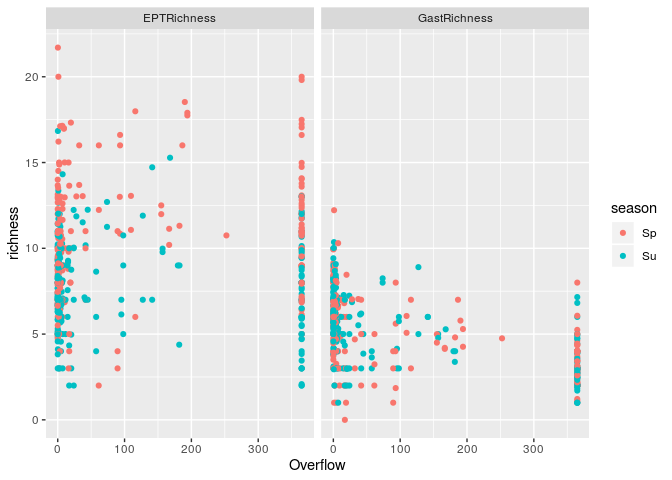
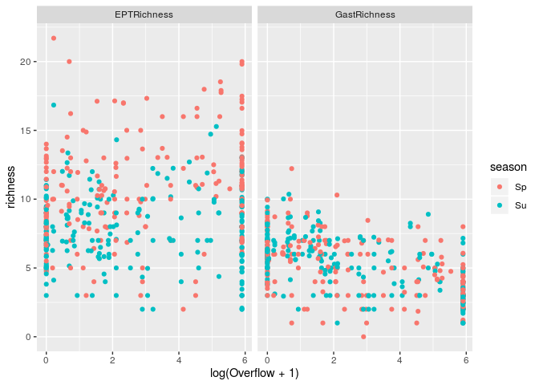
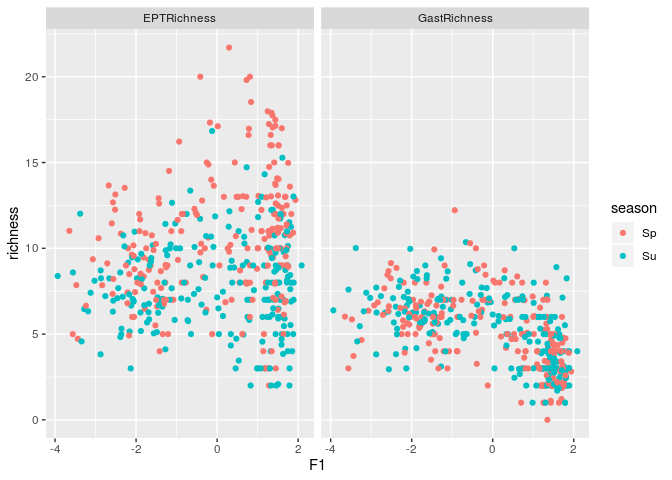

Diversity and lateral hydrological connectivity
================
DHP
January 11, 2019

    ## ── Attaching packages ───────────────────────────────── tidyverse 1.2.1 ──

    ## ✔ tibble  2.1.2     ✔ purrr   0.3.2
    ## ✔ tidyr   0.8.0     ✔ dplyr   0.8.1
    ## ✔ readr   1.1.1     ✔ stringr 1.3.0
    ## ✔ tibble  2.1.2     ✔ forcats 0.3.0

    ## ── Conflicts ──────────────────────────────────── tidyverse_conflicts() ──
    ## ✖ dplyr::filter() masks stats::filter()
    ## ✖ dplyr::lag()    masks stats::lag()

    ## here() starts at /cloudstore/dhugpe/ownCloud/Projects/traits-connectivity

    ## Loading required package: Matrix

    ## 
    ## Attaching package: 'Matrix'

    ## The following object is masked from 'package:tidyr':
    ## 
    ##     expand

    ## Loading required package: carData

    ## 
    ## Attaching package: 'car'

    ## The following object is masked from 'package:dplyr':
    ## 
    ##     recode

    ## The following object is masked from 'package:purrr':
    ## 
    ##     some

\#\#Graphical representation of relations between rarefied richness and
lateral hydrological connectivity

``` r
dflmer <- readRDS(here("NEW_DEC18","Tables","dflmer_w.rds"))
dflmer$EPTRichness <- dflmer$GastRichness + dflmer$PlecRichness + dflmer$TRichRichness 
dflmer$fstat <- factor(paste(dflmer$station, dflmer$site))
str(dflmer)
```

    ## 'data.frame':    447 obs. of  22 variables:
    ##  $ FRic         : num  0.0312 0.0531 0.019 0.0819 0.0186 ...
    ##  $ Simpson      : num  0.657 0.691 0.678 0.431 0.501 ...
    ##  $ RawRichness  : num  41 38 39 52 26 42 34 46 35 42 ...
    ##  $ RarRichness  : num  8.63 12.73 14.04 13.45 9.35 ...
    ##   ..- attr(*, "Subsample")= num 100
    ##  $ GastRichness : num  6 6.67 8 9.97 4 ...
    ##   ..- attr(*, "Subsample")= num 100
    ##  $ MayRichness  : num  2.91 1.99 3 1.07 1.35 ...
    ##   ..- attr(*, "Subsample")= num 100
    ##  $ PlecRichness : num  0 0 0 0 0 0 0 0 0 0 ...
    ##   ..- attr(*, "Subsample")= num 100
    ##  $ TRichRichness: num  4 1 2 1 3 0 4 2 3 2 ...
    ##   ..- attr(*, "Subsample")= num 100
    ##  $ BivRichness  : num  3 2 3 2 2 ...
    ##   ..- attr(*, "Subsample")= num 100
    ##  $ AmphRichness : num  1 2 2 2 1 1 1 1 2 2 ...
    ##   ..- attr(*, "Subsample")= num 100
    ##  $ Rao          : num  1.46 1.34 1.47 1.05 1.15 ...
    ##  $ FEve         : num  0.564 0.485 0.52 0.439 0.353 ...
    ##  $ FDis         : num  1.115 1.079 1.104 0.847 0.88 ...
    ##  $ F1           : num  -1.75 -1.8 -2.2 -2.04 -1.08 ...
    ##  $ Overflow     : num  0.25 0.25 0 0 0 0 1 1 0 0 ...
    ##  $ station      : Factor w/ 19 levels "BEAR","CHAN",..: 1 1 1 1 1 1 1 1 1 1 ...
    ##  $ site         : Factor w/ 5 levels "Ce","Do","DoN",..: 3 3 3 3 3 3 3 3 3 3 ...
    ##  $ sector       : Factor w/ 2 levels "BELL","BREG": 1 1 1 1 1 1 1 1 1 1 ...
    ##  $ season       : Factor w/ 2 levels "Sp","Su": 1 2 1 2 1 2 1 2 1 2 ...
    ##  $ year         : int  2007 2007 2009 2009 2011 2011 2012 2012 2013 2013 ...
    ##  $ EPTRichness  : num  10 7.67 10 10.97 7 ...
    ##   ..- attr(*, "Subsample")= num 100
    ##  $ fstat        : Factor w/ 40 levels "BEAR Do","BEAR DoN",..: 2 2 2 2 2 2 2 2 2 2 ...

``` r
tab_long_orders <- gather(dflmer, key = order, value = richness, c(5:10,21))

f_brut_o <- tab_long_orders %>% 
  filter(order %in% c("EPTRichness", "GastRichness")) %>% 
  ggplot(aes(Overflow, richness,color = season))
f_brut_f1 <- tab_long_orders %>% 
  filter(order %in% c("EPTRichness", "GastRichness")) %>% 
  ggplot(aes(F1, richness,color = season))
f_log_o <- tab_long_orders %>% 
  filter(order %in% c("EPTRichness", "GastRichness")) %>% 
  ggplot(aes(log(Overflow+1), richness,color = season))


f_brut_o + geom_point() + facet_wrap(vars(order)) 
```

<!-- -->

``` r
f_log_o + geom_point() + facet_wrap(vars(order)) 
```

<!-- -->

``` r
f_brut_f1 + geom_point() + facet_wrap(vars(order))
```

<!-- -->

## Models

``` r
names(dflmer)
```

    ##  [1] "FRic"          "Simpson"       "RawRichness"   "RarRichness"  
    ##  [5] "GastRichness"  "MayRichness"   "PlecRichness"  "TRichRichness"
    ##  [9] "BivRichness"   "AmphRichness"  "Rao"           "FEve"         
    ## [13] "FDis"          "F1"            "Overflow"      "station"      
    ## [17] "site"          "sector"        "season"        "year"         
    ## [21] "EPTRichness"   "fstat"

``` r
m1 <- lm(GastRichness ~ log(Overflow+1)+season, data=dflmer)


mm1 <-  lmer(GastRichness ~ Overflow + season + (1|station), data=dflmer, REML = F)
mm1_1 <-  lmer(GastRichness ~ F1 + season + (1|station), data=dflmer, REML = F)
mm1_2 <-  lmer(GastRichness ~ log(Overflow+1) + season + (1|station), data=dflmer, REML = F)

mm2 <-  lmer(EPTRichness ~ Overflow  + (1|station) +(1|season), data=dflmer, REML = F)
mm2_1 <-  lmer(EPTRichness ~ F1 + (1|station)+(1|season), data=dflmer, REML = F)
```

    ## Warning in checkConv(attr(opt, "derivs"), opt$par, ctrl = control
    ## $checkConv, : Model failed to converge with max|grad| = 0.00279586 (tol =
    ## 0.002, component 1)

``` r
mm2_2 <-  lmer(EPTRichness ~ log(Overflow+1) + (1|station)+(1|season), data=dflmer, REML = F)

summary(mm1)
```

    ## Linear mixed model fit by maximum likelihood  ['lmerMod']
    ## Formula: GastRichness ~ Overflow + season + (1 | station)
    ##    Data: dflmer
    ## 
    ##      AIC      BIC   logLik deviance df.resid 
    ##   1701.3   1721.8   -845.7   1691.3      442 
    ## 
    ## Scaled residuals: 
    ##     Min      1Q  Median      3Q     Max 
    ## -3.0829 -0.5735 -0.0852  0.5487  3.5066 
    ## 
    ## Random effects:
    ##  Groups   Name        Variance Std.Dev.
    ##  station  (Intercept) 0.4619   0.6797  
    ##  Residual             2.4024   1.5500  
    ## Number of obs: 447, groups:  station, 19
    ## 
    ## Fixed effects:
    ##              Estimate Std. Error t value
    ## (Intercept)  6.013165   0.225568  26.658
    ## Overflow    -0.008553   0.001081  -7.910
    ## seasonSu     0.115118   0.146915   0.784
    ## 
    ## Correlation of Fixed Effects:
    ##          (Intr) Ovrflw
    ## Overflow -0.541       
    ## seasonSu -0.325  0.013

``` r
summary(mm2)
```

    ## Linear mixed model fit by maximum likelihood  ['lmerMod']
    ## Formula: EPTRichness ~ Overflow + (1 | station) + (1 | season)
    ##    Data: dflmer
    ## 
    ##      AIC      BIC   logLik deviance df.resid 
    ##   2266.7   2287.2  -1128.3   2256.7      442 
    ## 
    ## Scaled residuals: 
    ##     Min      1Q  Median      3Q     Max 
    ## -2.7714 -0.6568 -0.0774  0.6241  3.5825 
    ## 
    ## Random effects:
    ##  Groups   Name        Variance Std.Dev.
    ##  station  (Intercept) 2.081    1.443   
    ##  season   (Intercept) 1.758    1.326   
    ##  Residual             8.323    2.885   
    ## Number of obs: 447, groups:  station, 19; season, 2
    ## 
    ## Fixed effects:
    ##              Estimate Std. Error t value
    ## (Intercept) 8.8186697  1.0359979   8.512
    ## Overflow    0.0001616  0.0022230   0.073
    ## 
    ## Correlation of Fixed Effects:
    ##          (Intr)
    ## Overflow -0.240

``` r
Anova(mm1)
```

    ## Analysis of Deviance Table (Type II Wald chisquare tests)
    ## 
    ## Response: GastRichness
    ##           Chisq Df Pr(>Chisq)    
    ## Overflow 62.563  1  2.581e-15 ***
    ## season    0.614  1     0.4333    
    ## ---
    ## Signif. codes:  0 '***' 0.001 '**' 0.01 '*' 0.05 '.' 0.1 ' ' 1

``` r
Anova(mm2)
```

    ## Analysis of Deviance Table (Type II Wald chisquare tests)
    ## 
    ## Response: EPTRichness
    ##           Chisq Df Pr(>Chisq)
    ## Overflow 0.0053  1     0.9421

``` r
Anova(mm2_1)
```

    ## Analysis of Deviance Table (Type II Wald chisquare tests)
    ## 
    ## Response: EPTRichness
    ##     Chisq Df Pr(>Chisq)
    ## F1 0.7915  1     0.3737

``` r
Anova(mm2_2)
```

    ## Analysis of Deviance Table (Type II Wald chisquare tests)
    ## 
    ## Response: EPTRichness
    ##                    Chisq Df Pr(>Chisq)
    ## log(Overflow + 1) 1.2928  1     0.2555

``` r
anova(mm1,mm1_1, mm1_2)
```

    ## Data: dflmer
    ## Models:
    ## mm1: GastRichness ~ Overflow + season + (1 | station)
    ## mm1_1: GastRichness ~ F1 + season + (1 | station)
    ## mm1_2: GastRichness ~ log(Overflow + 1) + season + (1 | station)
    ##       Df    AIC    BIC  logLik deviance Chisq Chi Df Pr(>Chisq)
    ## mm1    5 1701.3 1721.8 -845.65   1691.3                        
    ## mm1_1  5 1701.6 1722.1 -845.81   1691.6     0      0          1
    ## mm1_2  5 1712.1 1732.6 -851.04   1702.1     0      0          1

``` r
anova(mm2,mm2_1, mm2_2)
```

    ## Data: dflmer
    ## Models:
    ## mm2: EPTRichness ~ Overflow + (1 | station) + (1 | season)
    ## mm2_1: EPTRichness ~ F1 + (1 | station) + (1 | season)
    ## mm2_2: EPTRichness ~ log(Overflow + 1) + (1 | station) + (1 | season)
    ##       Df    AIC    BIC  logLik deviance  Chisq Chi Df Pr(>Chisq)    
    ## mm2    5 2266.7 2287.2 -1128.3   2256.7                             
    ## mm2_1  5 2266.0 2286.5 -1128.0   2256.0 0.7047      0  < 2.2e-16 ***
    ## mm2_2  5 2265.5 2286.0 -1127.7   2255.5 0.5082      0  < 2.2e-16 ***
    ## ---
    ## Signif. codes:  0 '***' 0.001 '**' 0.01 '*' 0.05 '.' 0.1 ' ' 1

``` r
AIC(mm1,mm1_1, mm1_2)
```

    ##       df      AIC
    ## mm1    5 1701.305
    ## mm1_1  5 1701.628
    ## mm1_2  5 1712.078

``` r
AIC(mm2,mm2_1, mm2_2)
```

    ##       df      AIC
    ## mm2    5 2266.679
    ## mm2_1  5 2265.975
    ## mm2_2  5 2265.466
